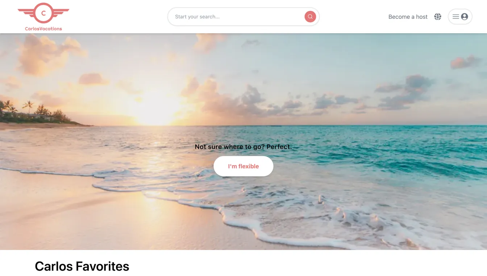
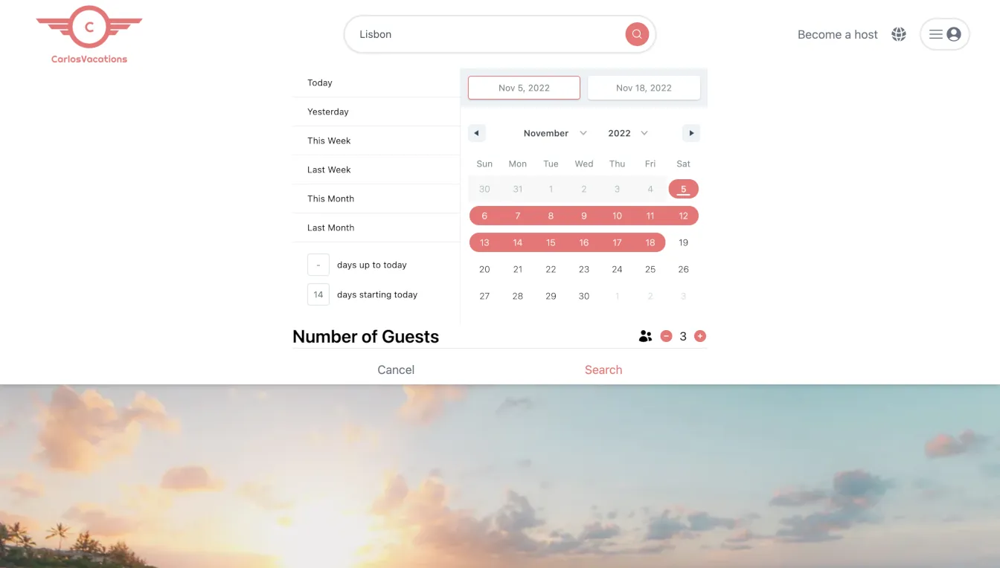

# Carlos Vacations

This is a hotel booking application created using Next.js and the Hotel API from RapidAPI.

## Overview

- Search for a destination and choose the dates and number of guests
- Results are rendered using Next.js ServerSideProps to fetch the data from an external API before the user is shown the results page
- Recieve hotel details for the destination and date range given
- View the location of the hotels rendered on Mapbox map

### Screenshot

### Links

- Live Site URL: [Carlos Vacations](https://airbnb-clone-one-puce.vercel.app/)

### Built with

- [React](https://reactjs.org/)
- [Next.js](https://nextjs.org/)
- [Tailwind](https://tailwindcss.com/)
- [Heroicons](https://heroicons.com/)
- [Mapbox](https://www.mapbox.com/)
- [Axios](https://www.npmjs.com/package/axios)
- [date-fns](https://date-fns.org/)
- [geolib](https://www.npmjs.com/package/geolib) 
- [react-date-range](https://www.npmjs.com/package/react-date-range) 
- [badrap-bar-of-progress](https://www.npmjs.com/package/@badrap/bar-of-progress)

### What I learned

With this project I learned the basics of using Next.js. I learned how to use Static Page Props for the homepage and Server Side Props for the Search page. I learned how navigation works within the Next.js framework. I also got a chance to practice working with an external API, in this case Hotel API by RapidAPI. I also learned how to implement a calendar and date-range selector into a website which is a very useful tool. Lastly I worked with mapbox and geolib and learned how to integrate a functional dynamic map component into a page.

### Continued development

For this project I'd like to try out some different hotel API's, possibly call multiple external API's and show all the results. Overall I'd like to dive deeper into Next.js and start working with the different functionalities that this framework offers.

### Useful resources

- [HotelsAPI](https://rapidapi.com/apidojo/api/hotels4/) - This the API used to render results to Carlos Vacations.

## Author

- Website - [Mick Maratta](https://mickmaratta.me/)
- Linkedin - [Mick Maratta](https://www.linkedin.com/in/mick-maratta-149b79250/)
# Carlos Vacations

This is a hotel booking application created using Next.js and the Hotel API from RapidAPI.

## Overview

- Search for a destination and choose the dates and number of guests
- Results are rendered using Next.js ServerSideProps to fetch the data from an external API before the user is shown the results page
- Recieve hotel details for the destination and date range given
- View the location of the hotels rendered on Mapbox map

### Screenshot

### Links

- Live Site URL: [Carlos Vacations](https://airbnb-clone-one-puce.vercel.app/)

### Built with

- [React](https://reactjs.org/)
- [Next.js](https://nextjs.org/)
- [Tailwind](https://tailwindcss.com/)
- [Heroicons](https://heroicons.com/)
- [Mapbox](https://www.mapbox.com/)
- [Axios](https://www.npmjs.com/package/axios)
- [date-fns](https://date-fns.org/)
- [geolib](https://www.npmjs.com/package/geolib) 
- [react-date-range](https://www.npmjs.com/package/react-date-range) 
- [badrap-bar-of-progress](https://www.npmjs.com/package/@badrap/bar-of-progress)

### What I learned

With this project I learned the basics of using Next.js. I learned how to use Static Page Props for the homepage and Server Side Props for the Search page. I learned how navigation works within the Next.js framework. I also got a chance to practice working with an external API, in this case Hotel API by RapidAPI. I also learned how to implement a calendar and date-range selector into a website which is a very useful tool. Lastly I worked with mapbox and geolib and learned how to integrate a functional dynamic map component into a page.

### Continued development

For this project I'd like to try out some different hotel API's, possibly call multiple external API's and show all the results. Overall I'd like to dive deeper into Next.js and start working with the different functionalities that this framework offers.

### Useful resources

- [HotelsAPI](https://rapidapi.com/apidojo/api/hotels4/) - This the API used to render results to Carlos Vacations.

## Author

- Website - [Mick Maratta](https://mickmaratta.me/)
- Linkedin - [Mick Maratta](https://www.linkedin.com/in/mick-maratta-149b79250/)
